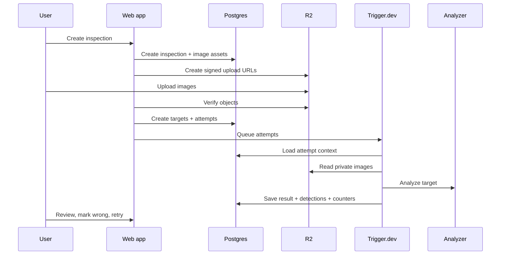

# Requirements

This document keeps the product and engineering requirements out of the README while preserving ownership and status.

## Product Requirements

| Requirement | Owner | Status |
| --- | --- | --- |
| One reference image defines the defect example. | Product | Built |
| A written defect description explains what to find. | Product | Built |
| A user can inspect up to 25 target images per inspection. | Product | Built |
| An inspection persists after refresh, navigation, or return visits. | Product + Engineering | Built |
| Progress is visible while processing runs. | Product + UX | Built with polling |
| Results are reviewable per target image. | Product + UX | Built |
| Failed targets remain visible. | Product + UX | Built |
| A failed target can be retried independently. | Product | Built |
| Human feedback is stored without overwriting analyzer output. | Product + Engineering | Built |

## Engineering And Security Requirements

| Requirement | Owner | Status |
| --- | --- | --- |
| Postgres is the source of truth for workflow state. | Engineering | Built |
| Object storage owns image bytes. | Engineering | Built |
| The browser uploads images through short-lived upload URLs. | Engineering + Security | Built |
| Jobs run outside the browser in a background worker. | Engineering | Built |
| Analyzer output is normalized before it reaches the UI. | Engineering | Built |
| Provider-specific response formats stay behind an adapter boundary. | Engineering | Built |
| Each result write is tied to a processing attempt. | Engineering | Built |
| Users can only access their own inspections and images. | Security | Built when Clerk is configured |
| Retention and permanent deletion policy is explicit. | Product + Compliance | Still needed |

## How Sightline Meets The Requirements

| Need | How Sightline does it | Benefit |
| --- | --- | --- |
| Durable inspections | Postgres stores inspections, targets, attempts, results, detections, feedback, and events. | Work survives refreshes, retries, worker failures, and return visits. |
| Private image handling | Cloudflare R2 stores image blobs; the database stores metadata and storage keys. | Images are not mixed into job messages or application state. |
| Slow external analysis | Trigger.dev or the local queue runs one processing attempt per target image. | The browser is not blocked by analyzer latency. |
| Reviewable results | Analyzer responses are normalized into `Result` and `Detection` records. | The UI can show stable boxes and statuses regardless of provider format. |
| Human correction | Feedback rows are additive and do not mutate raw analyzer output. | The system keeps an audit trail and can compare analyzer output to review decisions. |
| Partial failure handling | Each target has its own attempt/result lifecycle. | One failed image does not invalidate the whole inspection. |
| Replaceable infrastructure | Core rules live behind ports for storage, jobs, and analyzers. | R2, Trigger.dev, Gemini, or Postgres can be replaced with less product churn. |

## Workflow

## Domain Objects

| Object | Meaning |
| --- | --- |
| Inspection | One durable job |
| Defect spec | Reference image plus written description |
| Image asset | Private reference or target image metadata |
| Inspection target | Stable row for one target image |
| Processing attempt | One try at inspecting one target |
| Result | Analyzer outcome for one target attempt |
| Detection | One normalized pixel bounding box |
| Feedback | Human correction layered on analyzer output |
| Job event | Audit trail |
